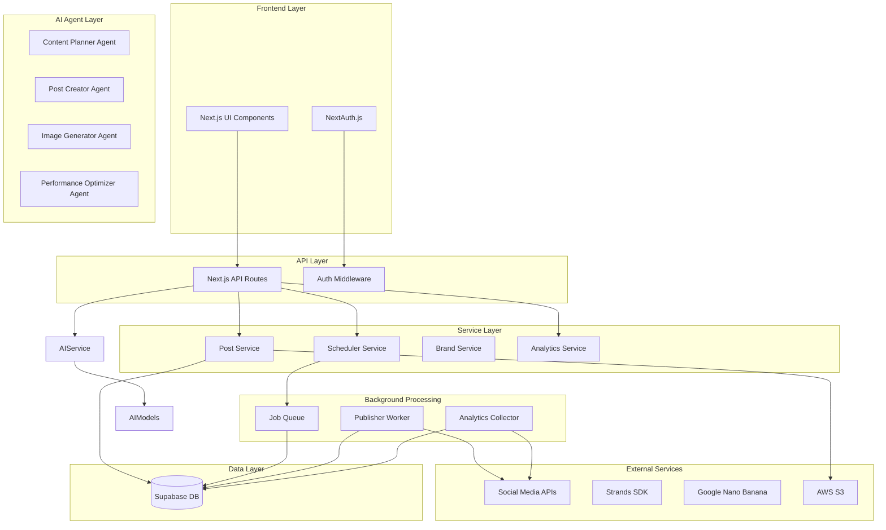

# Design Document

## Overview

The Social Media Automation Platform is an AI-first web application built with Next.js 15 and React 19, designed for complete social media management automation. The system uses Strands SDK to orchestrate AI agents that handle content strategy, post creation, image generation, and performance optimization. Users simply describe their brand, and the AI agents handle everything from content planning to publication and engagement analysis.

The architecture centers around AI agents that integrate with social media APIs, image generation services (Google Nano Banana), and analytics systems to provide fully autonomous social media management.

## Architecture

### High-Level Architecture



### Technology Stack

- **Frontend**: Next.js 15 with React 19, TailwindCSS, shadcn/ui
- **Backend**: Next.js API routes, NextAuth.js for authentication
- **Database**: Supabase (PostgreSQL with real-time features)
- **File Storage**: AWS S3 for media files
- **Background Jobs**: Custom queue system with Supabase as job store
- **AI Integration**: Strands SDK for AI agent orchestration, Google Nano Banana for image generation
- **Deployment**: AWS App Runner with Docker containers

## Components and Interfaces

### Frontend Components

#### Authentication Components
- `LoginForm`: Email/password authentication interface
- `SocialAccountConnector`: OAuth flow management for social media platforms
- `AccountManager`: Display and manage connected social media accounts

#### Manual Content Management Components
- `PostComposer`: Rich text editor with media upload capabilities
- `MediaUploader`: Drag-and-drop interface for images and videos
- `ManualScheduler`: Calendar interface for manual post scheduling
- `LinkPreview`: OpenGraph metadata display for shared links

#### AI-Powered Content Components
- `BrandSetup`: Interface for users to describe their brand and goals
- `ContentStrategyViewer`: Display AI-generated content calendars and strategies
- `AIPostGenerator`: Automated post creation with AI-generated content and images
- `ContentApprovalQueue`: Review and approve AI-generated posts before publication
- `PerformanceDashboard`: AI insights and optimization recommendations
- `WorkflowSelector`: Toggle between manual and AI-powered workflows

#### Scheduling Components
- `ScheduleSelector`: Date/time picker with timezone support
- `CalendarView`: Monthly calendar showing scheduled posts
- `QueueView`: List view of upcoming posts with editing capabilities
- `PlatformSelector`: Multi-select interface for target social media platforms

#### Analytics Components
- `MetricsDashboard`: Overview of engagement statistics
- `PostAnalytics`: Individual post performance metrics
- `TrendCharts`: Visual representation of engagement trends over time

### API Interfaces

#### Authentication Endpoints
```typescript
POST /api/auth/signin
POST /api/auth/signout
GET /api/auth/session
POST /api/auth/connect-social/{platform}
DELETE /api/auth/disconnect-social/{accountId}
```

#### Post Management Endpoints
```typescript
POST /api/posts - Create new post (manual)
GET /api/posts - List user's posts
PUT /api/posts/{id} - Update post
DELETE /api/posts/{id} - Delete post
POST /api/posts/{id}/schedule - Schedule post for publication
POST /api/posts/{id}/publish - Publish post immediately
POST /api/posts/upload-media - Upload images/videos for manual posts
POST /api/posts/generate-hashtags - AI hashtag suggestions for manual posts
POST /api/posts/generate-caption - AI caption assistance for manual posts
```

#### AI Agent Endpoints
```typescript
POST /api/ai/create-strategy - Generate comprehensive social media strategy
POST /api/ai/generate-calendar - Create content calendar for specified period
POST /api/ai/create-post - Generate complete post with content and image
POST /api/ai/generate-image - Create custom image using Google Nano Banana
POST /api/ai/optimize-performance - Analyze and optimize content strategy
POST /api/ai/auto-schedule - Automatically schedule posts based on optimal timing
```

#### Analytics Endpoints
```typescript
GET /api/analytics/overview - Dashboard metrics
GET /api/analytics/posts/{id} - Individual post metrics
GET /api/analytics/trends - Historical trend data
```

### Service Layer Interfaces

#### Manual Post Service
```typescript
interface PostService {
  createPost(data: PostData): Promise<Post>
  updatePost(id: string, data: Partial<PostData>): Promise<Post>
  deletePost(id: string): Promise<void>
  getPost(id: string): Promise<Post>
  getUserPosts(userId: string): Promise<Post[]>
  uploadMedia(file: File): Promise<MediaUrl>
  generateHashtagSuggestions(content: string): Promise<string[]>
  generateCaptionSuggestions(content: string): Promise<string[]>
}
```

#### AI Agent Services
```typescript
interface ContentPlannerAgent {
  createStrategy(brandInfo: BrandInfo): Promise<ContentStrategy>
  generateCalendar(strategy: ContentStrategy, timeframe: TimeFrame): Promise<ContentCalendar>
  optimizeStrategy(analytics: AnalyticsData): Promise<ContentStrategy>
}

interface PostCreatorAgent {
  generatePost(prompt: string, brandGuidelines: BrandGuidelines): Promise<GeneratedPost>
  createImagePrompt(postContent: string): Promise<string>
  adaptForPlatform(post: GeneratedPost, platform: Platform): Promise<GeneratedPost>
}

interface ImageGeneratorAgent {
  generateImage(prompt: string, style: ImageStyle): Promise<GeneratedImage>
  createVariations(baseImage: GeneratedImage, count: number): Promise<GeneratedImage[]>
}
```

#### Scheduler Service
```typescript
interface SchedulerService {
  schedulePost(postId: string, publishTime: Date, platforms: Platform[]): Promise<ScheduledJob>
  cancelScheduledPost(jobId: string): Promise<void>
  getScheduledPosts(userId: string): Promise<ScheduledJob[]>
  updateSchedule(jobId: string, newTime: Date): Promise<ScheduledJob>
}
```

#### Publisher Service
```typescript
interface PublisherService {
  publishToX(post: Post, credentials: XCredentials): Promise<PublishResult>
  publishToInstagram(post: Post, credentials: InstagramCredentials): Promise<PublishResult>
  publishToLinkedIn(post: Post, credentials: LinkedInCredentials): Promise<PublishResult>
  publishToFacebook(post: Post, credentials: FacebookCredentials): Promise<PublishResult>
  handlePublishFailure(job: ScheduledJob, error: Error): Promise<void>
}
```

## Data Models

### User Model
```typescript
interface User {
  id: string
  email: string
  createdAt: Date
  updatedAt: Date
  socialAccounts: SocialAccount[]
  brandProfile: BrandProfile
  contentStrategy: ContentStrategy
}
```

### Brand Profile Model
```typescript
interface BrandProfile {
  id: string
  userId: string
  brandName: string
  industry: string
  targetAudience: string
  brandVoice: string
  contentThemes: string[]
  postingFrequency: PostingFrequency
  brandColors: string[]
  logoUrl?: string
  createdAt: Date
  updatedAt: Date
}
```

### Content Strategy Model
```typescript
interface ContentStrategy {
  id: string
  brandProfileId: string
  objectives: string[]
  contentPillars: ContentPillar[]
  postingSchedule: PostingSchedule
  performanceTargets: PerformanceTarget[]
  createdAt: Date
  updatedAt: Date
}
```

### Generated Post Model
```typescript
interface GeneratedPost {
  id: string
  strategyId: string
  content: string
  imagePrompt: string
  generatedImageUrl?: string
  hashtags: string[]
  platforms: Platform[]
  suggestedPostTime: Date
  contentPillar: string
  aiConfidence: number
  status: 'generated' | 'approved' | 'rejected' | 'scheduled' | 'published'
  createdAt: Date
}
```

### Social Account Model
```typescript
interface SocialAccount {
  id: string
  userId: string
  platform: 'x' | 'instagram' | 'linkedin' | 'facebook'
  platformUserId: string
  username: string
  accessToken: string
  refreshToken?: string
  tokenExpiresAt?: Date
  isActive: boolean
  createdAt: Date
}
```

### Post Model
```typescript
interface Post {
  id: string
  userId: string
  content: string
  mediaUrls: string[]
  linkUrl?: string
  linkPreview?: LinkPreview
  hashtags: string[]
  status: 'draft' | 'scheduled' | 'published' | 'failed'
  creationType: 'manual' | 'ai_generated'
  aiGeneratedPostId?: string // Reference to GeneratedPost if AI-created
  createdAt: Date
  updatedAt: Date
  scheduledJobs: ScheduledJob[]
  publishedPosts: PublishedPost[]
}
```

### Scheduled Job Model
```typescript
interface ScheduledJob {
  id: string
  postId: string
  socialAccountId: string
  scheduledTime: Date
  status: 'pending' | 'processing' | 'completed' | 'failed'
  retryCount: number
  lastAttempt?: Date
  errorMessage?: string
  createdAt: Date
}
```

### Analytics Model
```typescript
interface PostAnalytics {
  id: string
  publishedPostId: string
  platform: string
  likes: number
  comments: number
  shares: number
  reach: number
  impressions: number
  clickThroughs: number
  collectedAt: Date
}
```

## Error Handling

### API Error Responses
All API endpoints return consistent error responses:
```typescript
interface APIError {
  error: string
  message: string
  statusCode: number
  timestamp: Date
}
```

### Social Media API Error Handling
- **Rate Limiting**: Implement exponential backoff with jitter for rate-limited requests
- **Token Expiration**: Automatic token refresh with fallback to user re-authentication
- **Platform Outages**: Graceful degradation with retry mechanisms and user notifications
- **Content Violations**: Clear error messages for content policy violations

### Background Job Error Handling
- **Failed Publications**: Automatic retry with exponential backoff (max 3 attempts)
- **Dead Letter Queue**: Failed jobs moved to separate queue for manual review
- **Error Logging**: Comprehensive logging of all failures with context
- **User Notifications**: Email alerts for critical failures

## Testing Strategy

### Unit Testing
- **Service Layer**: Test all business logic with mocked dependencies
- **API Routes**: Test request/response handling and validation
- **Components**: Test UI components with React Testing Library
- **Utilities**: Test helper functions and data transformations

### Integration Testing
- **Database Operations**: Test Supabase queries and mutations
- **External API Calls**: Test social media API integrations with mock servers
- **Authentication Flow**: Test OAuth flows and session management
- **File Upload**: Test S3 integration for media storage

### End-to-End Testing
- **User Workflows**: Test complete user journeys from login to post publication
- **Scheduling System**: Test post scheduling and background publication
- **Analytics Collection**: Test metrics gathering and display
- **Error Scenarios**: Test error handling and recovery mechanisms

### Performance Testing
- **Load Testing**: Test system performance under concurrent user load
- **Background Job Processing**: Test queue processing performance
- **Database Queries**: Optimize and test query performance
- **Media Upload**: Test large file upload handling

### Security Testing
- **Authentication**: Test OAuth flows and session security
- **Authorization**: Test user access controls and data isolation
- **Input Validation**: Test API input sanitization and validation
- **Token Security**: Test secure storage and handling of API tokens